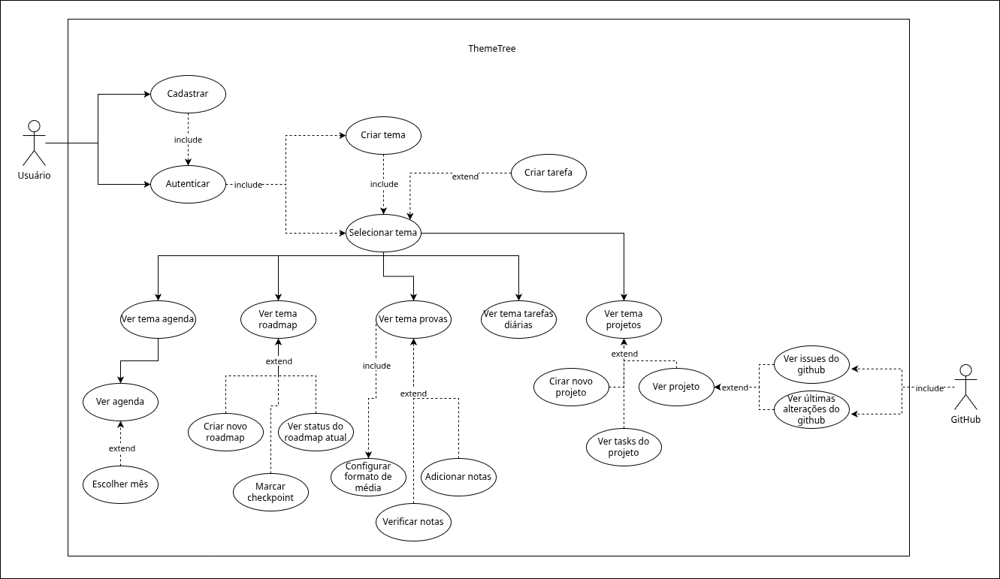
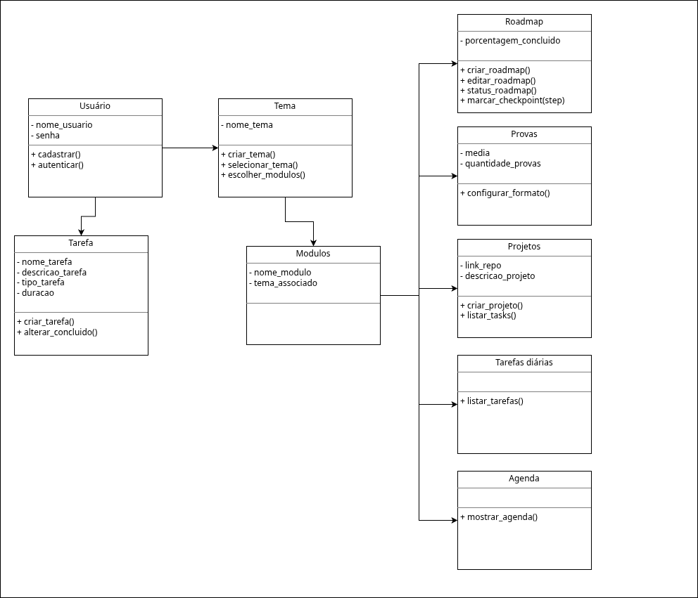

# Documento de Especificação de Requisitos e Modelagem (DERM)
Projeto: ThemeTree Versão: 0.1.0-alpha Data: 15 de Abril de 2026  
Aluno: Francisco Felipe Sampaio Neto 
---
1. Histórico de Revisões

Versão | Data | Descrição | Autor
-| - | - | -
0.1.0-alpha | 15/04/2026 | Criação do esqueleto da documentação | Francisco Felipe
0.1.1-alpha | 15/04/2026 | Esboço dos diagramas da modelagem UML | Francisco Felipe

### 2. Introdução
#### 2.1. Objetivo  
Este documento descreve os requisitos funcionais e não funcionais, bem como a modelagem UML (Casos de Uso e Classes) para o sistema ThemeTree.

#### 2.2. Escopo  
O projeto é um software de código aberto para organizar tarefas de forma mais simples e eficiente quando comparado com seus concorrentes.  

Como o nome sugere, ele foi pensado como uma Árvore de Temas, esses temas são contextos específicos com módulos dentro da aplicação.  

Ele foca principalmente em projetos de desenvolvimento de software contando com estruturas padrão para engenheiros de software além de integrações com o GitHub.

### 3. Levantamento de requisitos
#### 3.1. Requisitos funcionais  
ID | Nome | Descrição | Prioridade  
-|-|-|-   
RF01 | Cadastrar | Realizar cadastro de um novo usuário | Media
RF02 | Autenticar | Autenticar um usuário para ele entrar | Alta
RF03 | Criar Tema | Ciar um tema novo | Alta
RF04 | Editar Tema | Editar um tema novo escolhendo seus módulos e aparência | Alta
RF05 | Selecionar Tema | Permite navegar entre os temas existentes e seus modulos | Alta
RF06 | Ver agenda | Controi a agenta com as tarefas ativas | Alta
RF07 | Criar tarefa | Criar uma nova tarefa | Alta
RF08 | Editar tarefa | Editar uma tarefa existente | Alta
RF09 | Listar projetos | Listar os projetos criados | Alta
RF10 | Integrar GitHub | Pegar informações do repositório do projeto | Alta
RF11 | Editar projetos | Editar os projetos existentes | Alta
RF12 | Mostar TODO | Mostrar modulo com as tarefas do dia | Alta 
RF13 | Construir gráficos | Calcular métricas e apresentar graficos com estatisticas | Média
RF14 | Anexar arquivos | Fazer envio e armazenar arquivos | Média
RF15 | Criar roadmaps | Criar um novo caminho de aprendizado | Alta      

#### 3.2. Requisitos não Funcionais  
ID | Nome | Descrição | Prioridade  
-|-|-|-  
RNF01 | Plataforma | O software deve ser web | Alta
RNF02 | Compatibilidade | Tem que ser nativo de desktop e compatível com celulares | Média
RNF03 | Dados | Deve-se usar MySql para guardar dados, arquivos ficarão armazenados em diretórios | Alta
RNF04 | Backend | O backend vai ser escrito em Python com o framework Flask | Alta
RNF05 | UI | A interface será feita com HTML5 e CSS3 | Alta
RNF06 | Criptografia | Senhas devem ser criptografadas com hash | Alta

#### 3.3. Regras de Negócio
ID | Nome | Descrição | RF  
-|-|-|-  
RN01 | Quantidade de modulos | Um tema tem que ter no mínimo 1 módulo | RF03  
RN02 | Exibição GitHub | Detalhes do projeto só aparecerão em repositórios públicos | RF10

### 4. Modelagem UML
#### 4.1 Diagrama de Caso de Uso - [CONSERTAR]  

Detalhamento de Caso de Uso Principal   
Atores: Usuário 
Pré-condição: Conta de usuário criada.
Fluxo Principal:
1. O usuário auntentica com suas credenciais.
2. O usuário seleciona um tema para trabalhar.
3. O usuário cria uma nova tarefa.
4. O usuário pode consultar as tarefas criadas.  
Pós-condição: Tarefas são armazenadas no sistema.

#### 4.2 Diagrama de Classes [INCOMPLETO]

### 5. Dicionário de Dados
Classe | Atributo | Descrição  
-|-|-  
Usuário | nome_usuario | Nome do usuário
...

### 6. Prototipação de Telas

### 7. Conclusão e Justificativa Técnica