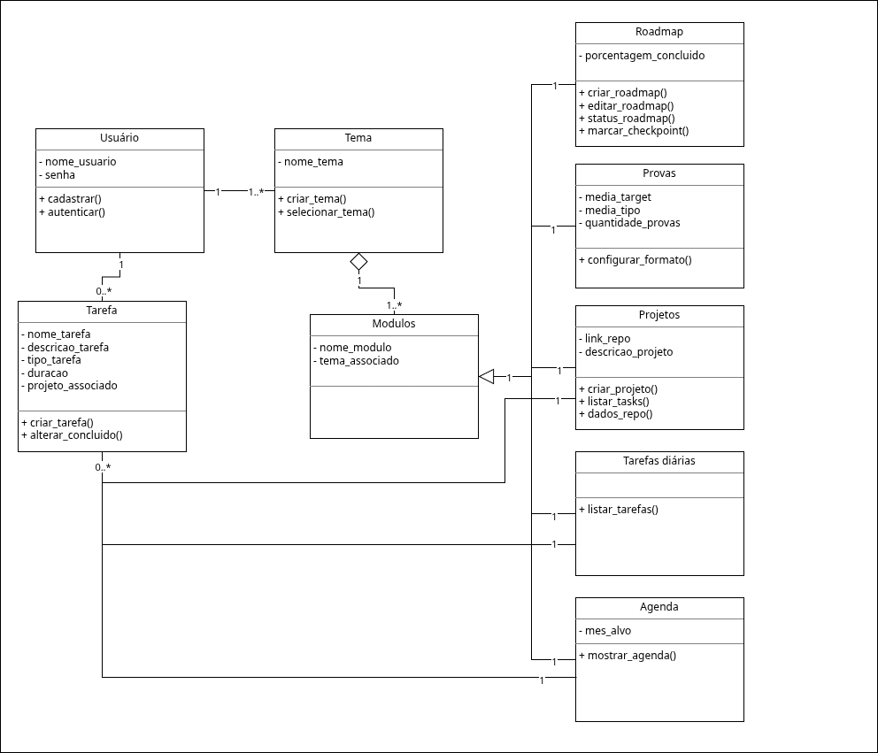
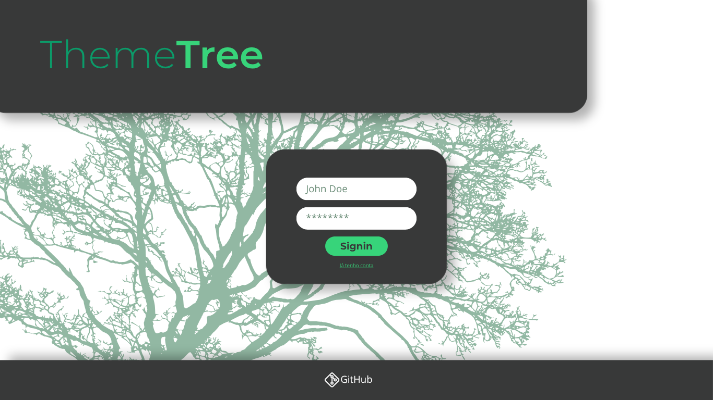
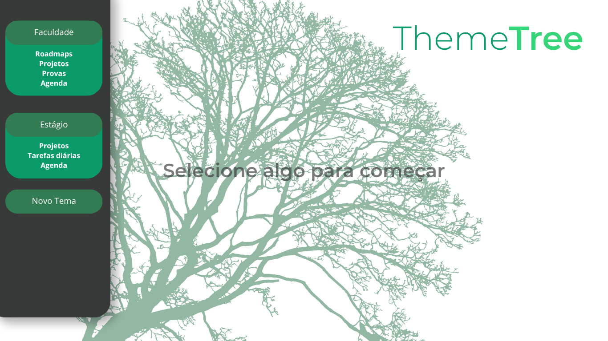
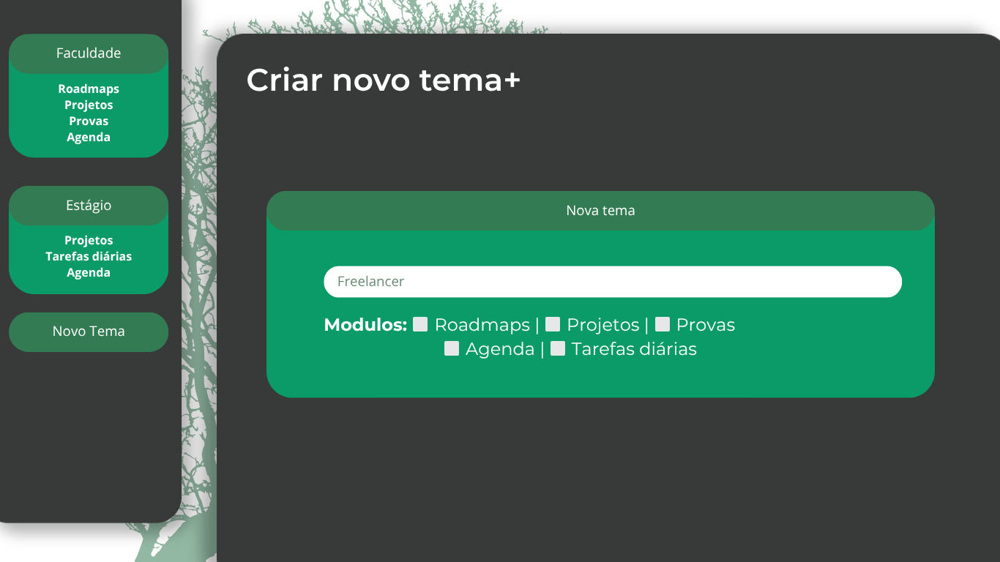
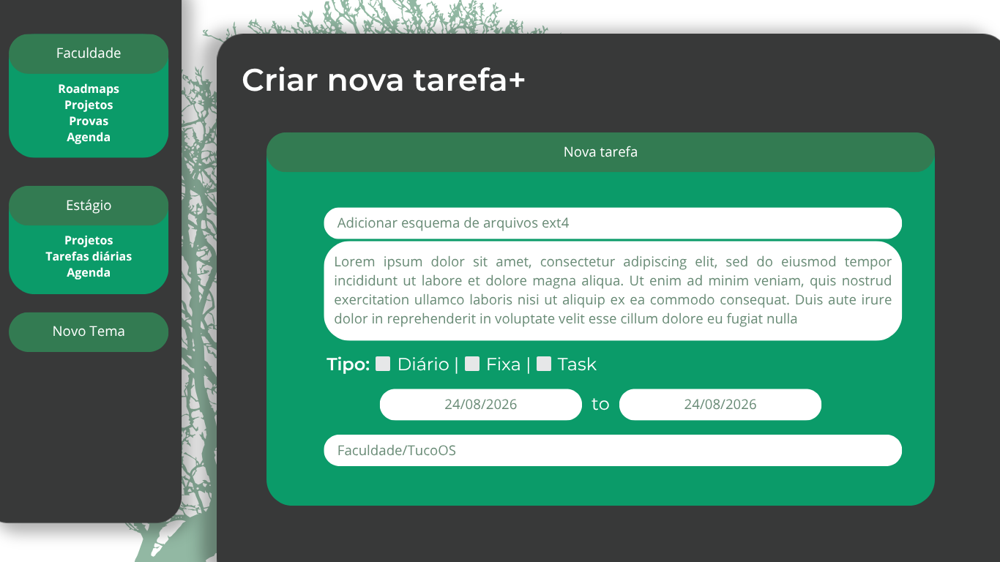
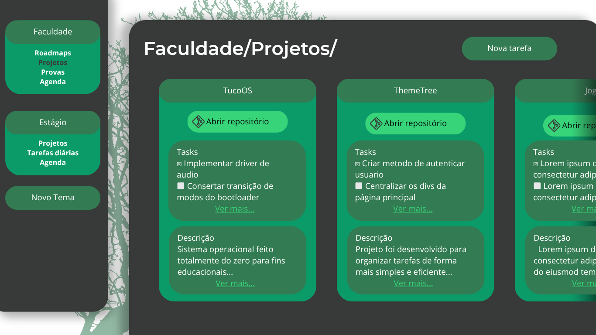

# Documento de Especificação de Requisitos e Modelagem (DERM)
Projeto: ThemeTree Versão: 0.2.0-alpha Data: 15 de Abril de 2026 Aluno: Francisco Felipe Sampaio Neto 
---
1. Histórico de Revisões

Versão | Data | Descrição | Autor
-| - | - | -
0.1.0-alpha | 15/04/2026 | Criação do esqueleto da documentação | Francisco Felipe
0.1.1-alpha | 18/04/2026 | Esboço dos diagramas da modelagem UML | Francisco Felipe
0.1.2-alpha | 19/04/2026 | Finalizado os diagramas UML e feito o dicionário de dados e criar protótipos | Francisco Felipe
0.2.0-alpha | 20/04/2026 | Documentação finalizada | Francisco Felipe
0.2.1-alpha | 26/04/2026 | Video adicionado | Francisco Felipe

### 2. Introdução
#### 2.1. Objetivo  
Este documento descreve os requisitos funcionais e não funcionais, bem como a modelagem UML (Casos de Uso e Classes) para o sistema ThemeTree.

#### 2.2. Escopo  
O projeto é um software de código aberto para organizar tarefas de forma mais simples e eficiente quando comparado com seus concorrentes.  

Como o nome sugere, ele foi pensado como uma Árvore de Temas, esses temas são contextos específicos com módulos dentro da aplicação.  

Ele foca principalmente em projetos de desenvolvimento de software contando com estruturas padrão para engenheiros de software além de integrações com o GitHub.

### 3. Levantamento de requisitos
#### 3.1. Requisitos funcionais  
ID | Nome | Descrição | Prioridade  
-|-|-|-   
RF01 | Cadastrar | Realizar cadastro de um novo usuário | Media
RF02 | Autenticar | Autenticar um usuário para ele entrar | Alta
RF03 | Criar Tema | Ciar um tema novo | Alta
RF04 | Editar Tema | Editar um tema novo escolhendo seus módulos e aparência | Alta
RF05 | Selecionar Tema | Permite navegar entre os temas existentes e seus modulos | Alta
RF06 | Ver agenda | Controi a agenta com as tarefas ativas | Alta
RF07 | Criar tarefa | Criar uma nova tarefa | Alta
RF08 | Editar tarefa | Editar uma tarefa existente | Alta
RF09 | Listar projetos | Listar os projetos criados | Alta
RF10 | Integrar GitHub | Pegar informações do repositório do projeto | Alta
RF11 | Editar projetos | Editar os projetos existentes | Alta
RF12 | Mostar TODO | Mostrar modulo com as tarefas do dia | Alta 
RF13 | Construir gráficos | Calcular métricas e apresentar graficos com estatisticas | Média
RF14 | Anexar arquivos | Fazer envio e armazenar arquivos | Média
RF15 | Criar roadmaps | Criar um novo caminho de aprendizado | Alta      


#### 3.2. Requisitos não Funcionais  
ID | Nome | Descrição | Prioridade  
-|-|-|-  
RNF01 | Plataforma | O software deve ser web | Alta
RNF02 | Compatibilidade | Tem que ser nativo de desktop e compatível com celulares | Média
RNF03 | Dados | Deve-se usar MySql para guardar dados, arquivos ficarão armazenados em diretórios | Alta
RNF04 | Backend | O backend vai ser escrito em Python com o framework Flask | Alta
RNF05 | UI | A interface será feita com HTML5 e CSS3 | Alta
RNF06 | Criptografia | Senhas devem ser criptografadas com hash | Alta
RNF06 | Armazenamento | Arqivos serão anexados no modulo de roadmaps | Baixa


#### 3.3. Regras de Negócio
ID | Nome | Descrição | RF  
-|-|-|-  
RN01 | Quantidade de modulos | Um tema tem que ter no mínimo 1 módulo | RF03  
RN02 | Exibição GitHub | Detalhes do projeto só aparecerão em repositórios públicos | RF10
RN03 | Licença | O projeto vai ser de código aberto, para ser hospedado localmente pelo usuário e conta com a licença MIT.


### 4. Modelagem UML
#### 4.1 Diagrama de Caso de Uso


Detalhamento de Caso de Uso Principal   
Atores: Usuário  
Pré-condição: Conta de usuário criada.  
Fluxo Principal:
1. O usuário auntentica com suas credenciais.
2. O usuário seleciona um tema para trabalhar.
3. O usuário cria uma nova tarefa.
4. O usuário pode consultar as tarefas criadas.  

Pós-condição: Tarefas são armazenadas no sistema.

#### 4.2 Diagrama de Classes


### 5. Dicionário de Dados
Classe | Atributo | Descrição  
-|-|-  
Usuário | nome_usuario | Nome do usuário
Usuário | senha | Senha do usuário
Tema | nome_tema | Indica o nome que o usuário dará a um tema
Tarefa | nome_tarefa | Indica o nome que o usuário dará a uma tarefa
Tarefa | descricao_tarefa | Fornece a descrição que o usuário dará a uma tarefa
Tarefa | tipo_tarefa | Indica o tipo que o usuário dará a uma tarefa, eles podem ser ```diaria```(ficará apenas até 00:00 do dia que foi criada), ```fixa```(ficará até ser marcada concluída), ```task```(igual a fixa mas associada a um projeto)
Tarefa | duracao | Opcional, presente apenas em tarefas fixas ou tasks, recebe uma data unica ou um intervalo de datas
Tarefa | projeto_associada | Vazia quando o ```tipo_tarefa``` for diferente de ```task```, caso contrário ela recebe o nome do projeto a qual está associada
Modulos | nome_modulo | Recebe o nome do módulo, sendo eles ```roadmap```, ```provas```, ```projetos```, ```diarias``` e ```agenda```
Modulos | tema_associado | Indica a qual tema o módulo pertence
Roadmap | porcentagem_concluido | Indica em porcentagem quantas tarefas já foram concluídas no roadmap
Provas| media_target | Se refere ao valor da média da instituição
Provas| media_tipo | Indica o tipo de cálculo de média da instituição, aritimética ou ponderada.
Provas| quantidade_provas | Informa a quantidade de provas que o usuário tem durante o periodo letivo.
Projetos | link_repo | Link do repositório do GitHub
Projetos | descricao_projeto | Fornece a descrição do projeto
Agenda | mes_alvo | Indica o mes que o usuário quer ver na agenda, por padrão será o mês atual

### 6. Prototipação de Telas
Nesta seção, são apresentados os esboços da interface do usuário. O objetivo é validar o fluxo
de navegação e a disposição dos elementos antes da fase de desenvolvimento.
#### 6.1 Guia de Estilo (UI Kit)
Cores Principais: Tons de verde[`#0b9b69`, `#337b52`], cinza[`#383939`] e branco[`#ffffff`]  
Tipografia: Montserrat  
Ferramenta utilizada: Canva  
#### 6.2 Protótipos de Média Fidelidade
  
#### Tela de login: Interface para autenticar usuários com os campos de nome e senha. Atende ao requisito RF02.
---

#### Tela de signin: Interface para criar um novo usuário para o sistema, com os mesmos campos do login, nome e senha. Atende ao requisito RF01.
---

#### Tela do menu: Interface disponível até o momento em que o usuário selecionar algum tema. Atende ao requisito RF05.
---

#### Tela de criação de novo tema: Interface para a criação de novos temas, aparece ao clicar no botão `Novo Tema`, a tela possui os campos de nome do tema e os módulos que o usuário quer nesse tema. Atende ao requisito RF03.
---

#### Tela de criação de nova tarefa: Interface para a criação de novas tarefas, aparece ao clicar no botão `Nova Tarefa`, a tela possui os campos de nome da tarefa, descrição, tipo, data(s) e caso esteja associado a um projeto, o nome do tema e do projeto. Atende ao requisito RF07.
---

#### Tela do módulo projetos: Interface que demonstra como serão os modulos, no caso, o módulo projetos, que conta com os projetos criados pelo usuário, cada um contendo link do repositório, tasks para o projeto e descrição do projeto. Atende ao requisito RF09.

### 7. Conclusão e Justificativa Técnica
Para a modelagem foi usado o diagrama de caso de uso e o diagrama de classes.  
O diagrama de caso de uso foi usado para apresentar todo o fluxo principal do usuário, passando pelas principais formas de uso do usuário.  
O diagrama de classes serve para mostrar as principais classes do sistema, mostra a dependencia dos modulos aos temas e a relação de multiplicidade entre as classes.

### 8. Video
[Assistir vídeo no Google Drive](https://drive.google.com/file/d/1DJRSZJ4G8ZvI24LasP8M85FoAHtqU3Js/view)

Caso o link não esteja funcionando, você também pode baixar o vídeo no repositório em `./src/videos/diagrama-classes.mp4`.